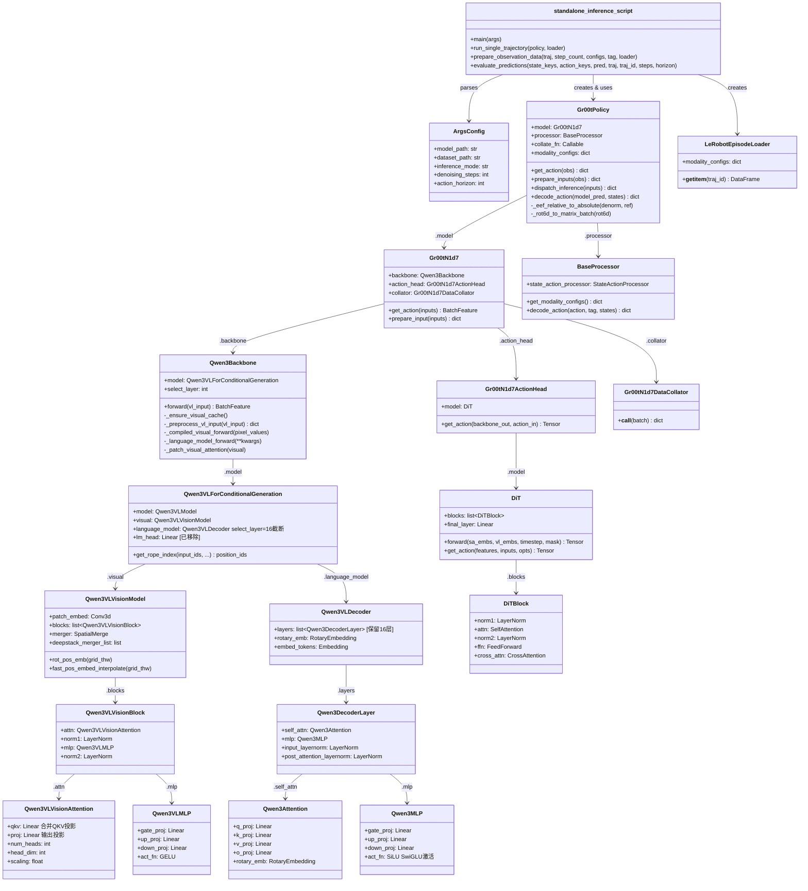
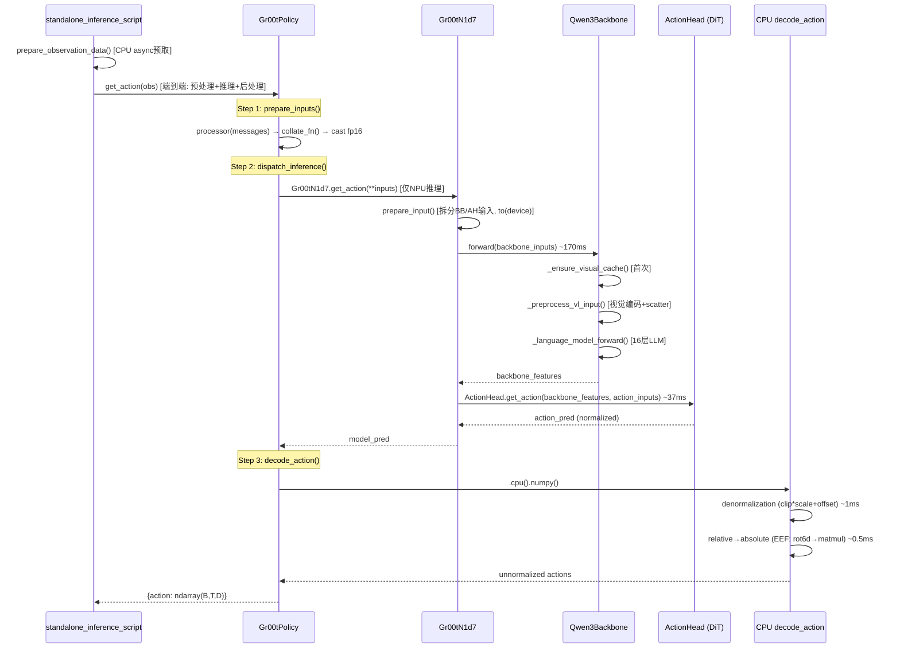
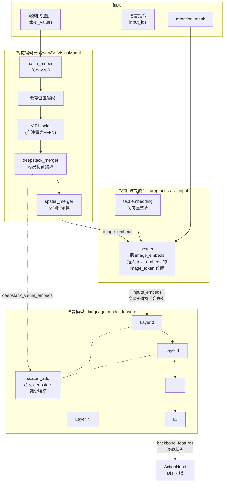

# GR00T N1.7 推理流程类图

## Story 描述

GR00T N1.7 是一个 VLA（Vision-Language-Action）机器人策略模型的离线推理系统。系统接收多相机图像、机器人关节状态和自然语言指令作为输入，通过视觉语言模型理解场景，再用扩散模型生成未来 16 步的关节运动轨迹。

## Story 上下文

- **应用场景**：机器人技能控制的 open-loop 评估，用录制的轨迹数据验证模型预测精度（MSE/MAE）
- **输入**：4 张相机图片 + 自然语言任务指令 + 机器人当前关节状态
- **输出**：未来 16 步的归一化动作预测（关节角度/末端位姿）
- **运行环境**：华为昇腾 NPU（torchair 图模式），对比基线为 NVIDIA H100 GPU
- **性能目标**：单步推理 < 200ms，精度 MSE 与 GPU 基线偏差 < 5%
- **核心约束**：backbone 权重冻结（Qwen3-VL 预训练），仅 ActionHead 参与训练

## 功能点分解（NPU 适配与优化）

### 算子适配
1. **NPU 基础适配**：fp16 dtype、eager attention、device 映射
2. **Conv3D 选择性 JIT**：patch_embed 的 Conv3D 缺少预编译内核，用 wrapper 临时切换 jit_compile
3. **RoPE NPU 替换**：用 `npu_rotary_mul` 替换标准 RoPE，适配昇腾算子
4. **FRACTAL_NZ 权重格式**：编译前将 Linear 权重转为 FRACTAL_NZ 格式优化内存布局
5. **Attention monkey-patch**：用 reshape 替代 `torch.split(lengths.tolist())`，消除动态 shape

### TorchAir 图编译
6. **Forward 拆分**：将 backbone forward 拆为 `_preprocess_vl_input`（eager）+ `_compiled_visual_forward` + `_language_model_forward`（compiled），绕过 Dynamo 不可 trace 的操作
7. **2D→3D 张量修复**：ViT 输入添加假 batch 维度，确保 torchair 使用高精度 3D 内核
8. **静态值缓存**：首次推理时预计算并缓存位置编码、旋转编码、cu_seqlens 等固定值
9. **分级编译控制**：compile_level 0/1/2 逐步验证每个编译模块的精度

### 推理优化
10. **Denoising 4→1**：ActionHead 去噪步数从 4 减到 1，4x 加速
11. **CPU/NPU 流水线重叠**：ThreadPoolExecutor 预取下一步观测数据，生产者-消费者模式
12. **decode_action 向量化**：反归一化 + relative→absolute 全部 numpy 向量化，104ms→1.5ms
13. **scatter_add 合并**：deepstack 视觉特征注入从 gather+add+scatter 三算子合并为 scatter_add 单算子
14. **FFN Split4**：LLM FFN 大 MatMul（2048→6144）拆为 4 个小 MatMul（2048→1536），提高 NPU cube 利用率

### 精度验证
15. **逐层精度排查**：确认 NPU vs CUDA 差异来自 fp16 硬件舍入，非代码 bug（CPU 对照 MSE 差异 <0.1%）
16. **FFN Split4 权重时序修复**：权重切分必须在 `model.to('npu')` 之后执行，避免格式转换导致数值分歧

### 优化效果

| 阶段 | 耗时 | 累计提升 |
|---|---|---|
| Baseline（全编译） | ~440ms | — |
| + denoising 4→1 | 347ms | 21% |
| + 流水线重叠 | 304ms | 31% |
| + decode_action 向量化 | 211ms | 52% |
| + scatter_add | 204ms | 54% |
| + FFN Split4 | **198ms** | **55%** |

## 类关系图

## 功能实现思路

### 1. TorchAir 图编译：拆分 eager 与 compiled 边界

大型 VLM 的 forward 混合了两类操作——数据依赖操作（动态 shape、`.tolist()`、scatter 按值索引）和纯 tensor 运算（MatMul、LayerNorm、attention）。Dynamo 只能 trace 后者。

将 backbone forward 拆为三段：
- `_preprocess_vl_input`：eager，处理视觉编码、scatter 融合、动态 position_ids
- `_compiled_visual_forward`：compiled，纯 ViT tensor 运算
- `_language_model_forward`：compiled，16 层 LLM tensor 运算

每段独立编译，用 `compile_level` 分级验证精度，而不是一次性全编译。

### 2. 精度控制：3D 张量 + fp32 softmax + 权重时序

torchair 编译时 2D 张量 `[seq, dim]` 经过 Linear/LayerNorm 使用的内核精度低于 3D `[1, seq, dim]`。在编译入口处 unsqueeze 添加假 batch 维度，退出时 squeeze 恢复。

视觉编码器的 attention 使用显式 `matmul + softmax(float32) + matmul`，确保 NPU 和 CUDA 的 softmax 行为一致。

权重切分/重组操作（如 FFN Split4）必须在 `model.to('npu')` 之后执行——`.to('npu')` 会对权重做内部格式转换，切分前后分别转换会导致数值分歧。

### 3. NPU 算子替换

- **RoPE**：用 `torch_npu.npu_rotary_mul` 替换 transformers 原始实现，将 q/k 合并后一次调用再 split
- **Conv3D**：`patch_embed` 的 Conv3d 缺少预编译内核，用选择性 JIT wrapper 在调用时临时切 `jit_compile=True`
- **Attention**：monkey-patch 视觉编码器的 attention forward，用 reshape 到固定 shape 替代 `torch.split(lengths.tolist())`
- **scatter_add**：deepstack 视觉特征注入从 gather+add+scatter 三算子合并为 scatter_add 单算子

### 4. CPU/NPU 流水线重叠

原始推理循环中 CPU 数据准备和 NPU 推理是串行的。改为生产者-消费者模式：ThreadPoolExecutor 在 CPU 线程上预取下一步观测数据，NPU 处理当前步时不等待 CPU 准备完成。通过共享 buffer 交接数据，NPU 完成后立即拿到下一份输入。

### 5. decode_action 向量化

原始实现逐元素 Python 循环做反归一化和 relative→absolute 转换（~104ms）。改为全 numpy 向量化：clip+scale+offset 批量计算，rot6d→旋转矩阵→齐次矩阵用矩阵运算批量处理，降至 ~1.5ms。

### 6. FFN Split4：拆大 MatMul 提高 cube 利用率

NPU cube 单元对中等尺寸 MatMul 利用率最高。将 LLM FFN 的 gate_proj/up_proj（2048→6144）各拆为 4 个 Linear（2048→1536），每个 chunk 独立计算 `silu(gate_i(x)) * up_i(x)`，cat 后交给 down_proj。数学等价性成立（逐元素操作对 chunk 独立），节省 ~6ms。

### 7. 精度排查方法论

对齐输入后逐层插桩，打印 mean/std 定位差异首次出现的位置。用 `register_forward_hook` 在子模块级别下钻。CPU 对照实验确认差异来源——两边都用 CPU 运行结果一致则差异来自硬件 fp16 舍入。

## 推理调用链

## 推理流程说明

### 整体流程

推理以轨迹（trajectory）为单位，对轨迹中的每一步循环执行"准备数据→模型推理→后处理"。CPU 通过线程池异步预取下一步的观测数据，与 NPU 推理并行执行（生产者-消费者模式）。

### 各阶段职责

**1. 数据准备（CPU，异步预取）**

`prepare_observation_data()` 从轨迹数据中提取当前步的 4 张相机图片、机器人关节状态和语言指令。在线程池上执行，不阻塞 NPU。

**2. 输入预处理（CPU，~5ms）**

`Gr00tPolicy.prepare_inputs()` 将原始观测转为模型输入格式：
- 图片 → pixel_values（像素值张量）
- 文本 → input_ids（token ID 序列）
- 状态 → 归一化到 [-1, 1] 范围
- 经 collate_fn 组 batch 后转为 fp16

**3. 模型推理（NPU，~210ms）**

`Gr00tN1d7.get_action()` 分两阶段：

- **Backbone（~170ms）**：Qwen3Backbone 处理视觉语言输入
  - 视觉编码器：4 张图片经 Conv3D → 24 层 ViT blocks → 空间降采样，输出 image_embeds（1024 tokens）
  - 第一次融合：scatter 将 image_embeds 插入 text_embeds 的 image_token 位置，形成混合序列
  - 语言模型：混合序列经过 16 层 Transformer，每层文本和图像 token 互相 attend
  - 第二次融合：scatter_add 在特定层注入 deepstack 视觉特征（来自 ViT 中间层）
  - 输出 backbone_features

- **ActionHead（~37ms）**：DiT 扩散模型生成动作
  - 生成随机噪声（16步 × action_dim）
  - 1 次去噪：编码噪声+时间步 → self-attention（状态+动作） → cross-attention（视觉语言特征） → 预测速度 → Euler 积分
  - 输出归一化空间的动作预测

**4. 后处理（CPU，~1.5ms）**

`decode_action()` 将模型输出从归一化空间转回物理空间：
- 反归一化：clip(-1, 1) × scale + offset
- relative→absolute：非 EEF 关节做加法，EEF 做 rot6d→旋转矩阵→齐次矩阵乘法

## 各阶段耗时（NPU, denoising_steps=1, layer=16）

| 阶段 | 耗时 | 设备 | 说明 |
|---|---|---|---|
| prepare_inputs | ~5ms | CPU | processor + collate |
| prepare_input (to device) | ~3ms | CPU→NPU | 数据搬运 |
| backbone.forward | ~170ms | NPU | 视觉编码 + 16层LLM |
| action_head.get_action | ~37ms | NPU | DiT 去噪推理 |
| decode_action | ~1.5ms | CPU | 反归一化 + relative→absolute |
| **总计** | **~200ms** | | |

## Backbone 内部数据流（视觉与语言的交互）

### 交互要点

1. **图像编码**：4 张图片经 Conv3D → ViT blocks → spatial merger，输出 image_embeds（1024 tokens）
2. **文本编码**：语言指令经词嵌入查表，得到 text_embeds
3. **第一次融合（scatter）**：把 image_embeds 按 image_token 位置插入 text_embeds，形成混合序列
4. **语言模型处理**：混合序列经过 16 层 Transformer，每层做自注意力（文本和图像 token 互相 attend）
5. **第二次融合（scatter_add）**：在特定层注入 deepstack 视觉特征（来自 ViT 中间层），增强视觉信息
6. **输出**：backbone_features 传给 ActionHead
